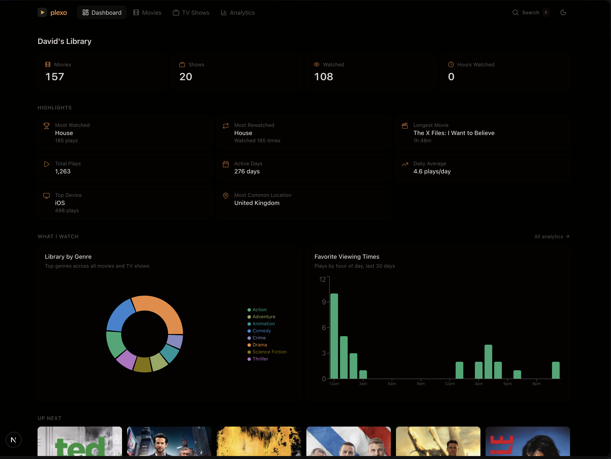

# Plexo

Personal media dashboard for your Plex library. Track your movies, TV shows, watch history, and viewing patterns — all in one self-hosted interface.

**[Live Demo](https://plexo.davidhome.ro)**

Built with Next.js 16, tRPC, Tailwind CSS v4, Recharts, and Framer Motion.



## Features

- **Dashboard** — library stats, highlights (most watched, most rewatched, longest movie, top device, location), genre breakdown and viewing time charts, up next, recently watched with platform/duration per play
- **Movies** — full library grid with genre/watched/unwatched filters and search, click any movie for details (summary, cast, ratings, watch history)
- **TV Shows** — library grid with episode progress bars and completion filters, per-season episode breakdown with missing episode detection
- **Analytics** — 8 chart visualizations with configurable time range (7d/30d/MTD/90d/year), period navigation with left/right arrows
- **Global Search** — <kbd>Cmd+K</kbd> command palette searching movies and TV shows, filter by genre or director
- **Admin Panel** — <kbd>Cmd+L</kbd> to view cache status, purge caches (protected by secret)
- **Smart Caching** — tiered TTLs (library 1hr, metadata 30min, analytics 15min, activity 5min), server-side image cache (24hr)
- **Recommendations** — visitors can recommend movies/TV shows via a dialog: search TMDB, enter name + optional message, submit. Notifications sent via Resend, SMTP, or Discord webhook. Optional Cloudflare Turnstile captcha. Rate limited to 5/hr per IP with Turnstile bypass.
- **Privacy Controls** — `SHOW_DEVICES` and `SHOW_LOCATIONS` env vars to control what data is exposed
- **Docker** — multi-stage build, pushes to GHCR via GitHub Actions
- **Analytics** — optional Plausible integration with self-hosted instance support

## How It Works

Plexo pulls data from two sources on your home network:

1. **Plex Media Server** — library contents, metadata, watch status, on-deck items. The `PLEX_TOKEN` determines whose watch data is shown (each Plex user has their own token). All requests go through a server-side API client that adds the token, so it never reaches the browser.

2. **Tautulli** — watch history, play statistics, device/platform info, IP geolocation. Tautulli monitors your Plex server and provides detailed analytics that Plex itself doesn't expose.

Data flow:
```
Browser → Next.js tRPC → In-memory cache → Plex/Tautulli APIs
                              ↓
                    Cache hit? Return cached data
                    Cache miss? Fetch from API, cache with TTL, return
```

All API calls are server-side only (`"server-only"` imports). The browser never talks to Plex or Tautulli directly. Poster images are proxied through `/api/plex-image` to keep the Plex token off the client and cached server-side for 24 hours.

tRPC procedures return `{ data, lastUpdatedAt }` so the UI always knows how fresh the data is. TanStack Query handles client-side caching with 5-minute stale time and 30-minute auto-refresh.

## Setup

### 1. Get your API keys

#### Plex Token

Your Plex token determines **which user's** watch data you see.

1. Sign in to Plex Web (`app.plex.tv`) or your server's web UI
2. Open any media item and click **Get Info** (or **View XML**)
3. In the URL bar you'll see `X-Plex-Token=xxxxxxxxxxxx` — that's your token
4. Alternatively: browser dev tools → Network tab → look for `X-Plex-Token` in any request

**For a managed/home user:** Sign in as that user (switch from top-right menu), then grab their token from the network tab. Each user has their own token. Library content is the same — only watch progress differs.

#### Tautulli API Key

1. Open your Tautulli web UI → **Settings** → **Web Interface**
2. Copy the **API Key** (or click **Generate** to create one)

#### Tautulli User ID (optional)

To scope Tautulli stats to a single user:

1. In Tautulli, go to **Users** → click the user
2. The URL shows `user_id=12345678` — set that as `TAUTULLI_USER_ID`

Leave empty to see stats for all users.

### 2. Clone and configure

```bash
git clone https://github.com/davidilie/plexo.git
cd plexo
cp .env.example .env
```

Edit `.env` — see `.env.example` for all available options.

### 3. Run locally

```bash
pnpm install
pnpm dev
```

Open [http://localhost:3000](http://localhost:3000).

### 4. Docker

```bash
docker build -t plexo .
docker run -p 3000:3000 --env-file .env plexo
```

Or pull from GHCR:

```bash
docker pull ghcr.io/davidilie/plexo:latest
```

## Environment Variables

| Variable | Required | Description |
|----------|----------|-------------|
| `PLEX_URL` | Yes | Plex server URL |
| `PLEX_TOKEN` | Yes | Plex authentication token (determines which user's data) |
| `TAUTULLI_URL` | Yes | Tautulli instance URL |
| `TAUTULLI_API_KEY` | Yes | Tautulli API key |
| `TAUTULLI_USER_ID` | No | Scope Tautulli stats to one user |
| `REFRESH_SECRET` | Yes | Secret for cache admin panel (Cmd+L) |
| `DISPLAY_NAME` | No | Name shown on dashboard (default: "David") |
| `APP_URL` | No | Base URL for metadata/OG images (default: localhost:3000) |
| `SHOW_DEVICES` | No | Show device analytics (default: true) |
| `SHOW_LOCATIONS` | No | Show location analytics via geoip (default: false) |
| `PLAUSIBLE_ENABLED` | No | Enable Plausible analytics (default: false) |
| `PLAUSIBLE_DOMAIN` | No | Domain for Plausible tracking |
| `PLAUSIBLE_SCRIPT_URL` | No | Self-hosted Plausible script URL |
| `PLAUSIBLE_API_URL` | No | Self-hosted Plausible event API URL |
| `RECOMMEND_ENABLED` | No | Enable recommend feature (default: false) |
| `TMDB_API_KEY` | No | TMDB API key for searching movies/TV (required if recommendations enabled) |
| `TURNSTILE_SITE_KEY` | No | Cloudflare Turnstile site key (enables captcha on form) |
| `TURNSTILE_SECRET_KEY` | No | Cloudflare Turnstile secret key (enables server-side verification + rate limit bypass) |
| `RESEND_API_KEY` | No | Resend API key for email notifications |
| `RESEND_FROM` | No | Resend sender address (e.g. `Plexo <noreply@yourdomain.com>`) |
| `RECOMMEND_EMAIL_TO` | No | Email address to receive recommendations (used by Resend and SMTP) |
| `SMTP_HOST` | No | SMTP server hostname |
| `SMTP_PORT` | No | SMTP server port (default: 587) |
| `SMTP_USER` | No | SMTP username |
| `SMTP_PASS` | No | SMTP password |
| `SMTP_FROM` | No | SMTP sender address |
| `DISCORD_WEBHOOK_URL` | No | Discord webhook URL for recommendation notifications |

## Recommendations Setup

The recommend feature lets visitors suggest movies/TV shows to you. To enable it:

### 1. Get a TMDB API key

1. Create an account at [themoviedb.org](https://www.themoviedb.org/)
2. Go to **Settings** → **API** → **Request an API Key**
3. Copy your API key (v3 auth)

### 2. Set up a notification channel

You need at least one channel configured to receive recommendations. All configured channels fire in parallel.

**Discord (easiest):** Create a webhook in your Discord server (Server Settings → Integrations → Webhooks) and set `DISCORD_WEBHOOK_URL`.

**Resend:** Sign up at [resend.com](https://resend.com), get an API key, and set `RESEND_API_KEY`, `RESEND_FROM`, and `RECOMMEND_EMAIL_TO`.

**SMTP:** Set `SMTP_HOST`, `SMTP_PORT`, `SMTP_USER`, `SMTP_PASS`, `SMTP_FROM`, and `RECOMMEND_EMAIL_TO`.

### 3. Enable the feature

```env
RECOMMEND_ENABLED=true
TMDB_API_KEY=your_tmdb_api_key
# Plus at least one notification channel from above
```

A "Recommend" button with a heart icon will appear in the navbar.

### 4. Optional: Cloudflare Turnstile

To add captcha protection:

1. Go to [Cloudflare Turnstile](https://dash.cloudflare.com/?to=/:account/turnstile) and create a widget
2. Set `TURNSTILE_SITE_KEY` and `TURNSTILE_SECRET_KEY`

When Turnstile is configured, the captcha widget appears on the recommendation form. If a user hits the 5/hr rate limit, they can verify via Turnstile to reset their limit and continue.

## Caching

| Tier | TTL | What |
|------|-----|------|
| Library | 1 hour | Sections, genres |
| Metadata | 30 min | Movie/show listings |
| Analytics | 15 min | Computed aggregations |
| Activity | 5 min | On-deck, history |
| Images | 24 hours | Plex poster images |

<kbd>Cmd+L</kbd> opens the admin panel to view cache entries and purge all. Also available via API:

```bash
curl -X POST https://plexo.yourdomain.com/api/refresh \
  -H "Authorization: Bearer your-refresh-secret"
```

## Tech Stack

| Tool | Purpose |
|------|---------|
| Next.js 16 | App Router, RSC, standalone output |
| React 19 | UI |
| TypeScript 5.7+ | Strict mode |
| Tailwind CSS v4 | Styling (OKLCH color system) |
| shadcn/ui | Component library |
| tRPC 11 | Type-safe API layer |
| TanStack Query 5 | Data fetching + caching |
| Recharts 3 | Chart visualizations |
| Framer Motion | Animations |
| nuqs | URL state management |
| date-fns 4 | Date formatting |
| @takumi-rs/image-response | Dynamic OG images |
| next-plausible | Analytics (optional) |

## License

[MIT](LICENSE)
